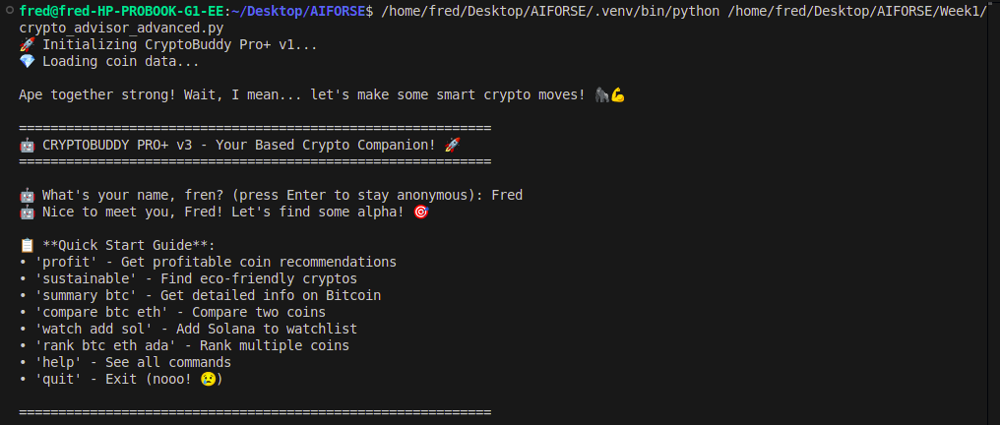
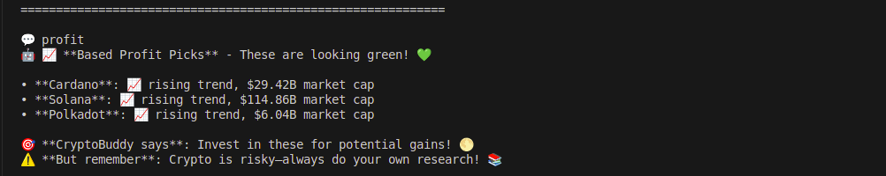
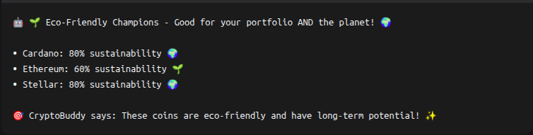
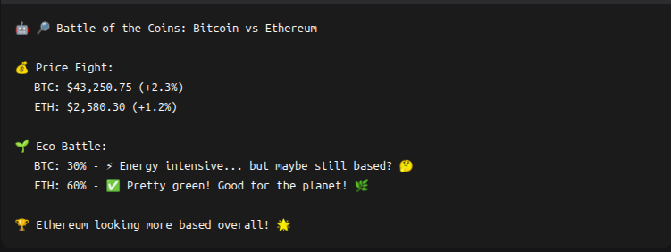
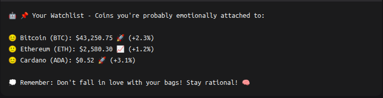

# CryptoBuddy Pro+ v1 🚀


> **Your based crypto companion with real-time data, sustainability analysis, and meme-loving personality!** 💎🙌

## 🌟 Overview

CryptoBuddy Pro+ is a sophisticated cryptocurrency advisor chatbot that combines **professional market analysis** with a **fun, engaging personality**. Built with Python, it fetches real-time data from CoinGecko API to provide intelligent recommendations based on profitability and sustainability metrics.

**WAGMI!** (We're All Gonna Make It) - Let's find you some green and growing cryptos! 🌱📈



## ✨ Features

### 🎯 Core Analysis

- **📈 Profitability Scoring** - Identify trending coins with growth potential
- **🌱 Sustainability Analysis** - Detect eco-friendly proof-of-stake vs energy-intensive proof-of-work
- **⚡ Risk Assessment** - Comprehensive risk scoring based on volatility, market cap, and liquidity
- **🔍 Real-time Data** - Live prices, market caps, and trends from CoinGecko API

### 🎮 Interactive Tools

- **🤖 Smart Chat Interface** - Natural conversation with crypto personality
- **📊 Coin Comparisons** - Head-to-head analysis of any two cryptocurrencies
- **🏆 Ranking System** - Multi-coin ranking with combined scoring
- **👀 Watchlist Management** - Track your favorite coins with emotional commentary
- **🔔 Price Alerts** - Simple polling-based alert system
- **📁 CSV Export** - Export your watchlist for external analysis

### 🎨 Personality & Fun

- **Meme-loving responses** with crypto culture references
- **Emotional reactions** to market movements
- **Encouraging messages** and community slang
- **Funny error handling** when things go "rekt"
- **Personalized experience** with user name recognition

## 🚀 Quick Start

### Installation

```bash
# Clone or download the script
# Install dependencies
pip install requests tqdm textblob

# Run the bot
python cryptobuddy_pro_plus_v1.py --interactive
```

### Basic Usage

```bash
# Interactive mode (recommended)
python cryptobuddy_pro_plus_v1.py --interactive

# Get profitability recommendations
python cryptobuddy_pro_plus_v1.py --profit

# Find sustainable coins
python cryptobuddy_pro_plus_v1.py --sustainable

# Compare two coins
python cryptobuddy_pro_plus_v1.py --compare BTC ETH

# Get coin summary
python cryptobuddy_pro_plus_v1.py --summary bitcoin
```



## 💬 Interactive Commands

Once in interactive mode, try these commands:

### 🎯 Analysis Commands

```
profit                    - Get based profit recommendations
sustainable               - Find eco-friendly coin picks
summary <coin>            - Detailed coin analysis (e.g., summary btc)
compare <coin1> <coin2>   - Head-to-head comparison (e.g., compare btc eth)
rank <coin1> <coin2> ...  - Rank multiple coins
price <coin>              - Quick price check
```

### 📊 Portfolio Management

```
watch add <coin>          - Add coin to watchlist
watch remove <coin>       - Remove from watchlist
watch show                - Show your watchlist with emotional commentary
export watch <filename>   - Export watchlist to CSV
```

### 🔔 Alert System

```
alerts <coin> <price> <above|below> - Price alert example
```

### 🎮 Fun & Social

```
hello / hi / gm           - Greet your based buddy
thanks                    - Show appreciation
help                      - See all commands
quit                      - Exit (nooo! 😢)
```

## 🏗️ Technical Architecture

### Core Components

- **`CryptoAdvisor`** - Main facade handling all operations
- **`DataClient`** - Robust CoinGecko API client with caching and retries
- **`CoinRegistry`** - Symbol/ID resolution system
- **`CryptoPersonality`** - Meme-loving response generator
- **Analysis Engine** - Sustainability, risk, and profitability scoring

### Advanced Features

- **Rate Limiting** - Respects CoinGecko API limits
- **Error Handling** - Graceful fallbacks and retries
- **Caching System** - Reduces API calls and improves performance
- **Modular Design** - Easy to extend and maintain

## 📊 Analysis Methodology

### Sustainability Scoring (0-100%)

```python
# Heuristic based on consensus mechanism
- Proof-of-Stake detected: 80-100%
- Proof-of-Work detected: 20-30%
- Foundation/non-profit signals: +15%
- Default/unknown: 50%
```

### Risk Assessment (0-1.0)

```python
# Multi-factor risk scoring
- Price volatility (24h change magnitude): 50%
- Market cap size: 30% 
- Liquidity (volume/market cap): 20%
```

### Combined Scoring

```python
# Balanced recommendation algorithm
combined_score = (
    sustainability * 0.4 + 
    (price_momentum / 100.0) * 0.3 - 
    risk * 0.3
)
```



## 🎨 Personality System

CryptoBuddy features a full personality system with:

- **Context-aware responses** based on market conditions
- **Crypto culture integration** (WAGMI, GM, based, rekt, etc.)
- **Emotional intelligence** reacting to price movements
- **Encouraging messages** to keep users engaged
- **Funny disclaimers** that maintain professionalism

### Example Personality Responses:

```
🚀 "BTC is pumping! Based! 📈"
🌱 "ADA: 80% sustainability - Mother Earth approves! 🌍"
⚠️ "High risk! Diamond hands required! 💎✋"
😅 "API might be taking a coffee break! ☕"
```

## 🔧 Configuration

### Environment Setup

The script works out-of-the-box with no API keys required! It uses CoinGecko's free tier with built-in rate limiting.

### Customization Options

- Modify `CryptoPersonality` class for different tone
- Adjust scoring weights in analysis functions
- Extend `DataClient` for additional API endpoints
- Add new commands to interactive mode

## 📈 Example Output

```
🤖 WAGMI, friend! Let's explore the crypto universe together! 🌌

🏆 Crypto Rankings - From based to rekt potential:

🥇 1. ADA - Cardano
   Score: 0.415 | Price: $0.52 🚀
   Risk: 🟢 0.45 | Sustain: 🌍 0.80

🥈 2. ETH - Ethereum  
   Score: 0.325 | Price: $2,580.30 📈
   Risk: 🟡 0.55 | Sustain: 🌱 0.60

🥉 3. BTC - Bitcoin
   Score: 0.215 | Price: $43,250.75 ↗️
   Risk: 🟡 0.60 | Sustain: ⚡ 0.30

💎 Pro tip: High sustainability + low risk = Probably won't get rekt! 😎
```



## ⚠️ Important Disclaimers

> **🚨 CRYPTO RISK WARNING**: Cryptocurrency investments are HIGHLY VOLATILE and RISKY. This tool provides EDUCATIONAL information only, NOT financial advice. Always conduct YOUR OWN RESEARCH (DYOR) and consult qualified financial advisors. NEVER invest more than you can afford to lose.

> **📊 Data Sources**: This tool uses CoinGecko's free API. Data accuracy depends on CoinGecko's sources and may have slight delays.

> **🎭 Personality Note**: The meme-loving personality is for entertainment purposes. The underlying analysis uses serious, professional methodologies.

## 🐛 Troubleshooting

### Common Issues

- **"Coin not found"**: Check your spelling or try using symbols (BTC) instead of names
- **API rate limits**: Built-in retry system will handle temporary issues
- **Connection errors**: Check your internet connection and firewall settings

### Dependencies Issues

```bash
# If TextBlob fails, it will use fallback sentiment analysis
# If tqdm fails, progress bars will be disabled
# Only 'requests' is strictly required
```

## 🔮 Future Enhancements

Planned features for future versions:

- [ ] Telegram/Discord bot integration
- [ ] Advanced technical indicators
- [ ] Portfolio tracking with P&L
- [ ] More exchange integrations
- [ ] Mobile app version

## 👥 Contributing

Feel free to fork and enhance! Some ideas:

- Add more personality responses
- Implement additional analysis metrics
- Create visualization components
- Add support for more data sources

---

**Remember fren**: Time in the market > timing the market! ⏰💎

**CryptoBuddy Pro+ v3** - Making crypto analysis both smart AND fun! 🚀✨

---



*Built with 💚 and ☕ by the crypto community. WAGMI!* 🌟
